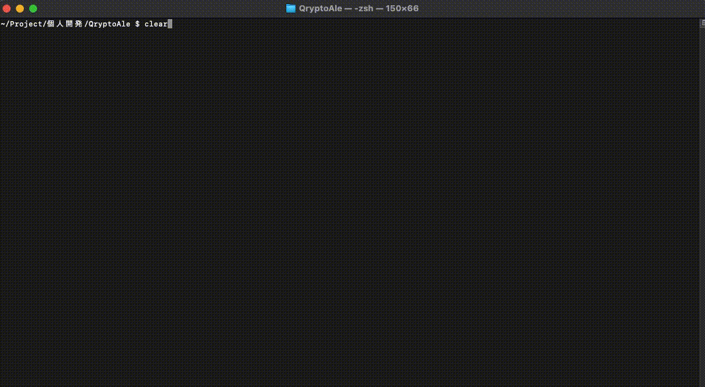

# qrypto-ale-cli-nodejs-typescript

## 概要

- 仮想通貨取引所(ここでは Binance)の API を利用し、渡されたシークレットに基づくユーザーの所持する通貨について各種情報を表示する
  - 表示する情報は下記
    - 所持している通貨リスト
    - それら通貨に対し下記をコンソールに出力する
      - 現在価格
      - 平均購入価格
      - 収支割合(平均購入価格 / 現在価格 \* 100)(%)

## 使用技術

| 名称             | バージョン | memo                   |
| ---------------- | ---------- | ---------------------- |
| Node.js          | 16.0.0     |                        |
| Typescript       | 4.2.3      |                        |
| jest             | 26.6.3     | ユニットテスト FW      |
| node-binance-api | 0.12.5     | Binance が提供する API |
| bignumber.js     | 9.0.1      | 少数計算のため導入     |
